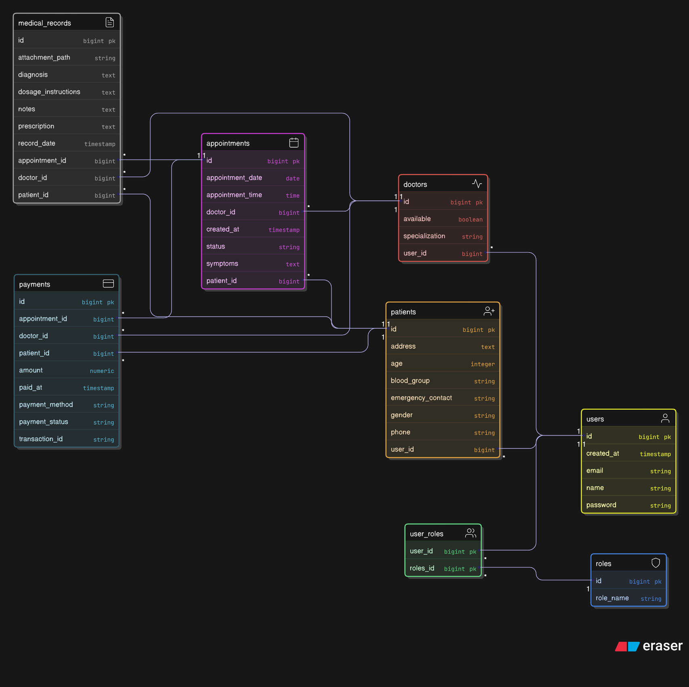

# Hospital Management System (HMS)

A comprehensive Spring Boot application for managing hospital operations, including patient registration, doctor management, appointment scheduling, medical records, and billing.

## Setup (5 Steps)

1.  **Prerequisites**: Ensure you have **Java 17** and **Maven** installed on your machine.
2.  **Database Setup**: Install **PostgreSQL** and create a new database named `hospital_db1`.
3.  **Configuration**: Open `src/main/resources/application.yaml` and verify the database credentials.
    ```yaml
    spring:
      datasource:
        url: jdbc:postgresql://localhost:5432/hospital_db1
        username: postgres # Change if necessary
        password: root     # Change if necessary
    ```
4.  **Build**: Open a terminal in the project root and run the following command to download dependencies and build the project:
    ```bash
    mvn clean install
    ```
5.  **Run**: Start the application:
    ```bash
    mvn spring-boot:run
    ```
    The API will be accessible at `http://localhost:8080`.
    Swagger UI is available at `http://localhost:8080/swagger-ui.html`.

## Database Schema Diagram




## Relationships Explained

*   **User & Roles**: A Many-to-Many relationship allows users to have multiple roles (though typically one in this logic).
*   **User & Profiles**: The `User` entity holds login credentials. It has a One-to-One relationship with `Doctor` and `Patient` entities which hold domain-specific data (specialization, medical history, etc.).
*   **Appointment**: The central entity connecting a `Doctor` and a `Patient`. It tracks the schedule and status (SCHEDULED, COMPLETED, CANCELLED).
*   **Payment**: Linked One-to-One with an `Appointment`. It ensures that a specific appointment is paid for. It also references Doctor and Patient for easier revenue calculation.
*   **MedicalRecord**: Linked One-to-One with an `Appointment`. This ensures that a medical record is strictly tied to a specific visit/consultation.

## All API Endpoints

### 1. Authentication (`/hms/auth`)
| Method | Endpoint | Description |
|--------|----------|-------------|
| POST | `/login` | Authenticate and receive JWT Token. |
| POST | `/register/patient` | Register a new patient account. |
| POST | `/register/doctor` | Register a new doctor (Requires ADMIN role). |

**Example Login Request:**
```json
{
    "email": "admin@hms.com",
    "password": "admin123"
}
```

### 2. Admin (`/hms/admin`) - *Requires ADMIN Role*
| Method | Endpoint | Description |
|--------|----------|-------------|
| GET | `/dashboard` | Get total doctors, patients, appointments, and revenue. |
| GET | `/revenue` | Get revenue reports. Params: `from`, `to`, `doctorId` (optional). |

### 3. Appointments (`/hms/appointments`)
| Method | Endpoint | Description |
|--------|----------|-------------|
| POST | `/book` | Book a slot. Body: `{ "doctorId": 1, "patientId": 1, "appointmentDate": "2023-12-01", "appointmentTime": "10:00:00", "symptoms": "..." }` |
| GET | `/patient/{id}` | View appointments for a specific patient. |
| GET | `/doctor/{id}` | View appointments for a specific doctor. |
| PATCH | `/{id}/cancel` | Cancel an appointment (must be >24hrs before). |

### 4. Medical Records (`/hms/medical-records`)
| Method | Endpoint | Description |
|--------|----------|-------------|
| POST | `/` | Create a record (Doctor only). Body: `{ "appointmentId": 1, "diagnosis": "Flu", "prescription": "Rest" }` |
| GET | `/patient/{id}` | Get medical history for a patient. |

### 5. Payments (`/hms/payments`)
| Method | Endpoint | Description |
|--------|----------|-------------|
| POST | `/` | Create payment for completed appointment. |
| PATCH | `/{id}/status` | Update status (e.g., `?status=PAID`). |


## Deploy Instructions

### 1. Package the Application
Run the Maven package command to generate the JAR file. This skips tests to speed up the process for deployment.
```bash
mvn clean package -DskipTests
```

### 2. Run the JAR
Navigate to the `target` directory and run the generated JAR file.
```bash
cd target
java -jar HMS-0.0.1-SNAPSHOT.jar
```